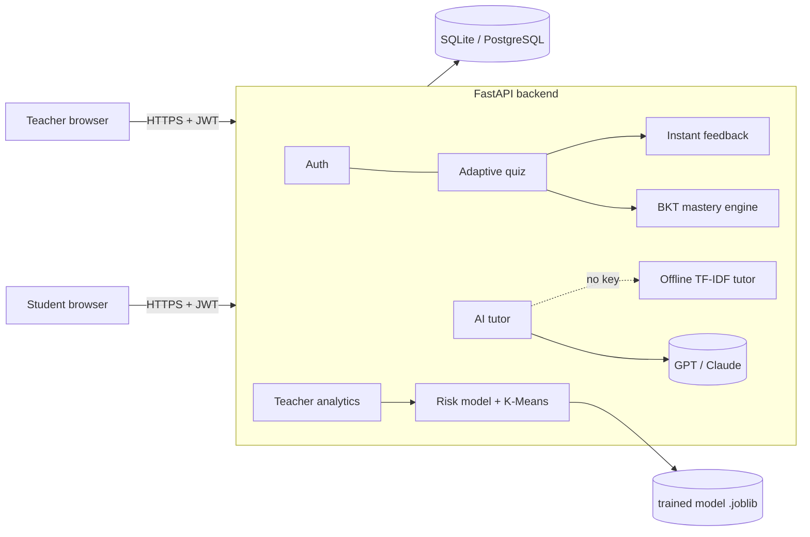

# Smart Tutor Platform: Project Guide

This guide connects the synopsis to the working system. Use it to plan the remaining work, write the final report, run the demo and prepare for the viva.

---

## 1. Synopsis → implementation map

| Synopsis module (Sec. 6) | Where it lives | What it actually does |
|---|---|---|
| 1. User Registration & Authentication | `routers/auth.py`, `auth.py` | Register/login with name, email, password, academic info, role. Passwords hashed with **bcrypt**; sessions use **JWT** tokens; role-based access (students can't open teacher APIs). Teachers need an invite code. |
| Frontend Interface | `frontend/src/pages/*` | Students: dashboard, learn, notes, adaptive quiz, AI tutor, progress. Teachers: class overview, student drill-down, question bank, content editor, doubts, AI model page. Responsive on mobile. |
| 2. Student Data Collection | `models.py` (Attempt, StudyLog, QuizSession), `services/features.py` | Logs every answer (correctness, difficulty, time taken), reading time per topic, quiz sessions and repeated mistakes. Turns them into 10 features per student. |
| 3. AI & ML Module | `services/ml.py`, `ml/train.py` | **At-risk classifier** (Logistic Regression vs Random Forest, best by ROC-AUC) and **K-Means clustering** into Needs Support / Steady / Fast learners. |
| 4. Adaptive Learning Mechanism | `services/adaptive.py` | **Bayesian Knowledge Tracing** per student per topic → difficulty of the next question, level of the notes shown (simplified / standard / advanced), and personalised recommendations. Past mistakes resurface. |
| 5. NLP & LLMs | `services/llm.py`, `routers/tutor.py` | GPT or Claude tutor that adapts its answers to the learner's level and weak topics; explains mistakes; drafts questions and notes. **Offline NLP fallback**: TF-IDF retrieval and cloze-question generation. |
| 6. Real-Time Assessment & Feedback | `routers/quiz.py` | Instant verdict, explanation, live mastery change, XP, "Explain my mistake" (LLM), and a full answer review with a revision list. |
| 7. Teacher Assistance & Analytics | `routers/teacher.py` | KPIs, risk ranking with reasons, cluster chart, topic heatmap, most-missed questions, per-student drill-down. |
| 8. Backend & API | FastAPI | REST API with auto-generated docs at `/docs` (use these in place of a Postman collection). |
| 9. Tools | VS Code, GitHub (+ CI workflow), Postman / Swagger, Jupyter for `ml/train.py` experiments | |

### Where "Natural Intelligence" is real, not just a slogan
1. **AI-generated questions are hidden until a teacher approves them** (`approved=False`). This is the human-in-the-loop quality check on the LLM.
2. **Teachers edit the three note levels.** The AI can draft a simplified or advanced version, but the teacher saves it.
3. **Doubt escalation:** students send doubts the AI can't settle to the teacher, and replies appear on the student dashboard.
4. **Mentoring:** the ML model flags at-risk students *with reasons*; the teacher decides the intervention and sends a personal note.

---

## 2. Architecture

**Stack:** React 18, Vite, Tailwind, Recharts · FastAPI, SQLAlchemy 2, Pydantic · scikit-learn · OpenAI / Anthropic SDKs · SQLite (dev) / PostgreSQL (prod) · Docker.

**Database tables:** users, subjects, topics, questions, quiz_sessions, attempts, mastery, study_logs, chat_messages, teacher_feedback.

---

## 3. The algorithms (explain these in the viva)

### 3.1 Bayesian Knowledge Tracing (BKT)
For each (student, topic) we keep **P(L)**, the probability the student has learned the topic.

After an answer:

- Correct: `P(L|correct) = P(L)(1−S) / [P(L)(1−S) + (1−P(L))G]`
- Wrong: `P(L|wrong) = P(L)S / [P(L)S + (1−P(L))(1−G)]`
- Then learning/forgetting: `P(L)_next = P(L|obs)(1−F) + (1−P(L|obs))·T`

| Parameter | Value | Meaning |
|---|---|---|
| P(L₀) | 0.30 | prior knowledge |
| T (learn) | 0.03 | chance of learning per step |
| F (forget) | 0.05 | keeps mastery responsive to recent errors |
| G (guess) | 0.30 / 0.25 / 0.20 | easy / medium / hard |
| S (slip) | 0.20 / 0.28 / 0.35 | easy / medium / hard |

Guess and slip depend on difficulty, so a correct *hard* answer is stronger evidence than a correct *easy* one, and a wrong *easy* answer is stronger evidence of a gap. There's a unit test for this.

**Levels:** P(L) < 0.45 → Beginner, < 0.75 → Intermediate, ≥ 0.75 → Advanced.

### 3.2 Adaptive question selection
1. Base difficulty from the level: Beginner → Easy, Intermediate → Medium, Advanced → Hard.
2. Streak adjustment: two correct in a row → one level up; a wrong answer → one level down.
3. Within that difficulty, prefer questions the student **previously got wrong** (spaced review), then unseen ones.

### 3.3 At-risk prediction (supervised ML)
- **Features (10):** overall / easy / hard / recent accuracy, trend, average time per question, number of attempts, study minutes, average mastery, active days.
- **Label:** end-of-term score < 40%.
- **Data:** no real student data exists at launch, so `ml/train.py` simulates 4,000 learners from hidden *ability* and *diligence* (a standard approach in educational data mining). Small-sample noise is modelled the way the app produces it.
- **Models compared:** Logistic Regression and Random Forest; the higher test ROC-AUC is saved.
- **Current results:** about **84% accuracy, 0.90 ROC-AUC**. They're shown on the teacher's *AI Model* page along with feature importances.
- Once real students have used the app: `python -m ml.train --from-db`.
- Labels: < 0.3 On track, 0.3–0.6 Watch, ≥ 0.6 High risk, plus plain-English reasons ("struggles with hard questions", "recent performance dropping").

### 3.4 Learner clustering (unsupervised ML)
K-Means (k = 3) on standardised [accuracy, hard accuracy, avg time, mastery, trend]. Clusters are named by mean accuracy, so the labels stay stable and explainable.

### 3.5 NLP / LLM
- **Tutor prompt** includes the learner profile (level on the topic, weak and strong topics) and the topic notes, which grounds the answer and limits hallucination. Beginners get analogies; advanced learners get edge cases and a stretch question.
- **Mistake explanation** targets the specific wrong option the student chose.
- **Question generation** asks the LLM for strict JSON, validates it (4 options, valid index), and stores the questions as *pending* for teacher approval.
- **Offline fallback:**
  - TF-IDF + cosine similarity picks the most relevant paragraphs from the notes.
  - Cloze generation blanks a **bold key term** in a sentence and uses other key terms as distractors.

---

## 4. Seven-minute demo script

1. **Login page.** Explain AI + Natural Intelligence in one line. Click **Student demo**.
2. **Student dashboard (Ananya).**
   - Strong in Python, weak in DBMS.
   - Point at: the teacher's personal message, the *Recommended for you* cards, *Learning health* from the ML model, and the 14-day trend.
3. **Learn → DBMS → Normalization.**
   - The notes open as the *Simplified* version because she's a Beginner.
   - Toggle to *Advanced* to show the three levels.
4. **Start adaptive quiz.**
   - Answer one wrong: instant feedback, mastery drops, the next question eases off.
   - Click **Explain my mistake** (LLM).
   - Answer two right: "Stepping up: harder question".
5. **Result page.** Answer review, then **AI Tutor**: "Explain 2NF vs 3NF with an example".
6. **Sign out → Teacher demo.**
   - Class overview: KPIs, at-risk list with reasons, K-Means donut, topic heatmap (red = re-teach), most-missed questions.
7. **Click an at-risk student.**
   - Mastery, mistakes, trend.
   - **Suggest a message → Send.** That's Natural Intelligence.
8. **Question Bank → Generate with AI.**
   - The drafts are *Pending review*.
   - Approve one: only approved questions reach students.
9. **AI Model page.** Metrics table, feature importance, and the pipeline.

Tip: run `python -m app.seed --reset` before the demo so the data is fresh.

---

## 5. What your team should do next

| Priority | Task | Why |
|---|---|---|
| 1 | Run it locally and rehearse the demo script above | Know every screen before the review |
| 2 | Get an OpenAI or Anthropic API key and set it in `.env` | The LLM tutor is noticeably smarter than offline mode |
| 3 | Pilot with 15–30 classmates for 1–2 weeks, then `python -m ml.train --from-db` | Gives you **real results** for the report (before/after quiz scores, mastery gain, a usage survey) |
| 4 | Add content: more topics or your syllabus units (Teacher → Content and Question Bank) | Shows scalability; no code changes needed |
| 5 | Deploy with Docker on Render or Railway and put the link in the report | A live URL impresses examiners |
| 6 | Write the report chapters: system design (Sec. 2), algorithms (Sec. 3), results (screenshots + model metrics + pilot data), testing (12 automated tests) | Maps directly onto the synopsis chapters |

### Suggested evaluation for the report
- **Model:** accuracy, F1 and ROC-AUC table (on the AI Model page), plus a confusion matrix from `ml/train.py`.
- **Learning gain:** average score in each student's first vs. latest quiz per topic.
- **Adaptivity:** the share of questions served at each difficulty level for weak vs. strong students.
- **Usability:** a short SUS (System Usability Scale) survey from pilot users.

### Future enhancements (synopsis Sec. 4 "future scope")
- Voice input (Web Speech API) and voice answers from the tutor
- Descriptive-answer grading with an LLM rubric
- Gamification: leaderboards and streak calendars (XP and badges already exist)
- Collaborative study rooms; a parent portal
- Deep Knowledge Tracing (LSTM) once enough real data exists
- Multi-language support (Kannada / Hindi) via the LLM

---

## 6. Likely viva questions

**Q: Why BKT and not just a percentage score?**
A percentage treats an old mistake and a new one equally and ignores guessing and slips. BKT is a probabilistic model of knowledge that updates after every answer, accounts for lucky guesses and careless slips, and is the classic model behind intelligent tutoring systems (used in Carnegie Learning's Cognitive Tutor).

**Q: Your ML model is trained on simulated data. Isn't that a weakness?**
It's the standard cold-start approach: the simulator encodes known relationships (ability → accuracy, diligence → practice), so the system works from day one. The pipeline already supports retraining on real data (`--from-db`), and that's planned in the pilot phase.

**Q: How do you stop the LLM from giving wrong answers?**

1. The prompt is grounded in our own notes.
2. Generated questions are validated and then require teacher approval.
3. Students can escalate a doubt to a teacher.
4. Explanations show the vetted textbook explanation first, with the LLM as an addition.

**Q: What happens if the API is down or there's no key?**
Automatic offline mode: TF-IDF retrieval tutor and cloze question generator. The app never breaks.

**Q: How is the data secured?**

- Passwords hashed with bcrypt, never stored in plain text.
- Stateless JWT auth with expiry.
- Role checks on every teacher endpoint.
- The correct answer is never sent to the browser before the student answers.
- Secrets live in `.env`.

**Q: How does it scale?**

- Stateless API, so you can run multiple workers or containers.
- PostgreSQL in production.
- One Docker image.
- LLM calls are the main cost, and they're per request with timeouts.

**Q: What does "Natural Intelligence" mean concretely?**
The four human-in-the-loop features in Section 1: teacher approval of AI questions, teacher-curated notes, doubt escalation, and teacher mentoring of ML-flagged students.
